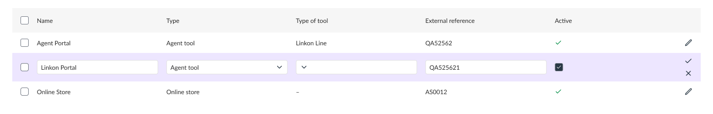

# turnit-test

Need to implement editable row table with next stack:
• Typescript
• React
• material-ui@latest
• react-final-form@latest
• react-table@7._._

Final application should have save and cancel functionality for each separate row, saving should be stored in memory, so can be reset on page refresh.

Columns are:
• Text
• Dropdown
• Dropdown with multiselect
• Text
• Checkbox
• Icons for actions



## How to run

```bash
yarn

yarn dev
```

Open the App [locally](http://localhost:5173/) or you can use [GitHub Pages](https://khavrolev.github.io/turnit-test/).
